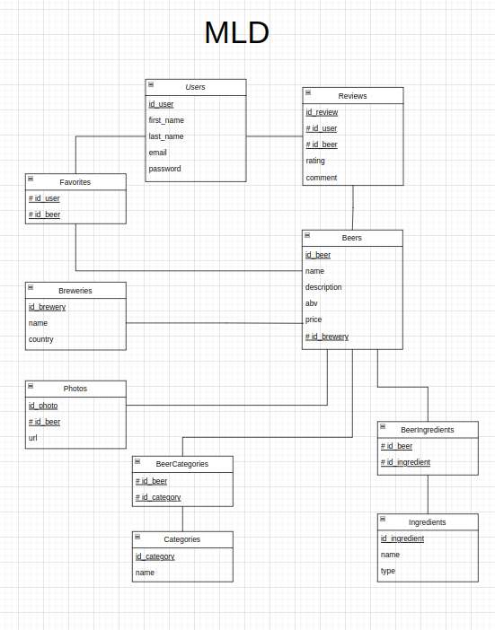

## Règles de gestion

1. Un utilisateur ne peut utiliser qu'une seule adresse email.
2. Une bière appartient à une seule brasserie.
3. Une bière peut avoir plusieurs catégories.
4. Chaque bière doit avoir au moins un ingrédient.
5. Les notes sont comprises entre 1 et 5.
6. Les taux d'alcool (ABV) doivent être compris entre 0 et 20.

## MCD

## MLD

## MPD

## Dictionnaire de données

| Entity          | Attribut      | Type          | Size | Required | Possible Values / Business Rules | Description                           |
| --------------- | ------------- | ------------- | ---- | -------- | -------------------------------- | ------------------------------------- |
| **Users**       | id_user       | SERIAL        |      | Yes      | Auto-increment                   | ID unique de l'utilisateur            |
|                 | first_name    | VARCHAR       | 50   | Yes      |                                  | Prénom de l'utilisateur               |
|                 | last_name     | VARCHAR       | 100  | Yes      |                                  | Nom de l'utilisateur                  |
|                 | email         | VARCHAR       | 255  | Yes      | UNIQUE                           | Adresse email de l'utilisateur        |
|                 | password      | VARCHAR       | 255  | Yes      |                                  | Mot de passe de l'utilisateur         |
|                 | created_at    | TIMESTAMP     |      | Yes      | Auto-generated                   | Date de création de l'utilisateur     |
|                 | updated_at    | TIMESTAMP     |      | Yes      | Auto-generated                   | Dernière mise à jour de l'utilisateur |
| **Beers**       | id_beer       | SERIAL        |      | Yes      | Auto-increment                   | ID unique de l'utilisateur            |
|                 | name          | VARCHAR       | 100  | Yes      |                                  | Nom de la bière                       |
|                 | description   | TEXT          |      | Yes      |                                  | Description de la bière               |
|                 | abv           | FLOAT         |      | Yes      | 0 <= abv <= 20                   | Taux d'alcool de la bière             |
|                 | price         | DECIMAL(10,2) |      | Yes      | >= 0                             | Prix de la bière                      |
|                 | id_brewery    | INT           |      | Yes      | FK vers Breweries(id_brewery)    | Clé étrangères vers la brasserie      |
|                 | created_at    | TIMESTAMP     |      | Yes      | Auto-generated                   | Date de création de la bière          |
|                 | updated_at    | TIMESTAMP     |      | Yes      | Auto-generated                   | Dernière mise à jour de la bière      |
| **Categories**  | id_category   | SERIAL        |      | Yes      | Auto-increment                   | Id unique de la catégorie             |
|                 | name          | VARCHAR       | 100  | Yes      | UNIQUE                           | Nom de la catégorie                   |
|                 | created_at    | TIMESTAMP     |      | Yes      | Auto-generated                   | Date de création de la catégorie      |
|                 | updated_at    | TIMESTAMP     |      | Yes      | Auto-generated                   | Dernière mise à jour de la catégorie  |
| **Breweries**   | id_brewery    | SERIAL        |      | Yes      | Auto-increment                   | Id unique de la brasserie             |
|                 | name          | VARCHAR       | 100  | Yes      | UNIQUE                           | Nom de la brasserie                   |
|                 | country       | VARCHAR       | 40   | Yes      |                                  | Pays d'origine                        |
|                 | created_at    | TIMESTAMP     |      | Yes      | Auto-generated                   | Date de création de la brasserie      |
|                 | updated_at    | TIMESTAMP     |      | Yes      | Auto-generated                   | Dernière mise à jour de la brasserie  |
| **Reviews**     | id_review     | SERIAL        |      | Yes      | Auto-increment                   | Id unique de l'avis                   |
|                 | id_user       | INT           |      | Yes      | FK vers Users(id_user)           | Clé étrangères vers l'utilisateur     |
|                 | id_beer       | INT           |      | Yes      | FK vers Beers(id_beer)           | Clé étrangères vers la bière          |
|                 | rating        | INT           |      | Yes      | 1 <= rating <= 5                 | Note attribuée à la bière             |
|                 | comment       | TEXT          |      | No       |                                  | Commentaire sur la bière              |
|                 | created_at    | TIMESTAMP     |      | Yes      | Auto-generated                   | Date de création de l'avis            |
|                 | updated_at    | TIMESTAMP     |      | Yes      | Auto-generated                   | Dernière mise à jour de l'avis        |
| **Favorites**   | id_user       | INT           |      | Yes      | FK vers Users(id_user)           | Clé étrangères vers l'utilisateur     |
|                 | id_beer       | INT           |      | Yes      | FK vers Beers(id_beer)           | Clé étrangères vers la bière          |
| **Photos**      | id_photo      | SERIAL        |      | Yes      | Auto-increment                   | Id unique de la photo                 |
|                 | id_beer       | INT           |      | Yes      | FK vers Beers(id_beer)           | Clé étrangères vers la bière          |
|                 | url           | FILE          |      | Yes      |                                  | URL de la photo                       |
|                 | created_at    | TIMESTAMP     |      | Yes      | Auto-generated                   | Date de création de la photo          |
|                 | updated_at    | TIMESTAMP     |      | Yes      | Auto-generated                   | Dernière mise à jour de la photo      |
| **Ingredients** | id_ingredient | SERIAL        |      | Yes      | Auto-increment                   | Id unique de l'ingrédient             |
|                 | name          | VARCHAR       | 100  | Yes      |                                  | Nom de l'ingrédient                   |
|                 | type          | VARCHAR       | 50   | No       | Ex. : malt, houblon, levure      | Type d'ingrédient                     |
|                 | id_beer       | INT           |      | Yes      | FK vers Beers(id_beer)           | Clé étrangères vers la bière          |
|                 | created_at    | TIMESTAMP     |      | Yes      | Auto-generated                   | Date de création de la photo          |
|                 | updated_at    | TIMESTAMP     |      | Yes      | Auto-generated                   | Dernière mise à jour de la photo      |
